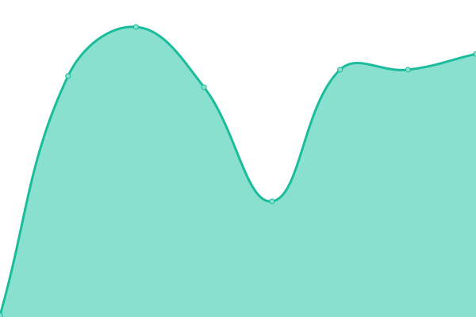
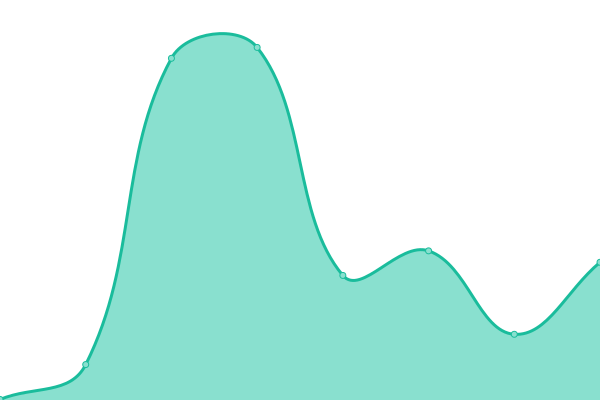
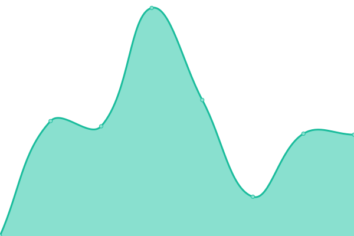
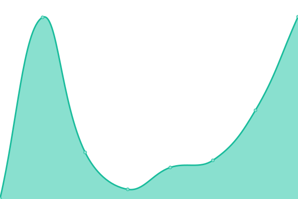
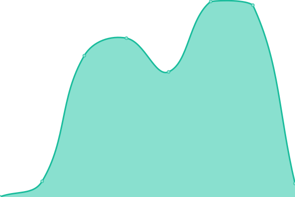

# [📈 Live Status](https://WaqasIshaque1.github.io/folio-uptime): <!--live status--> **🟧 Partial outage**

This repository contains the open-source uptime monitor and status page for [Waqas Ishaque](https://waqasishaque.netlify.app/), powered by [Upptime](https://github.com/upptime/upptime).

With [Upptime](https://upptime.js.org), you can get your own unlimited and free uptime monitor and status page, powered entirely by a GitHub repository. We use [Issues](https://github.com/WaqasIshaque1/folio-uptime/issues) as incident reports, [Actions](https://github.com/WaqasIshaque1/folio-uptime/actions) as uptime monitors, and [Pages](https://WaqasIshaque1.github.io/folio-uptime) for the status page.

<!--start: status pages-->
<!-- This summary is generated by Upptime (https://github.com/upptime/upptime) -->
<!-- Do not edit this manually, your changes will be overwritten -->
<!-- prettier-ignore -->
| URL | Status | History | Response Time | Uptime |
| --- | ------ | ------- | ------------- | ------ |
|  [GoGo-Anime](https://gogoanimehd.to/) | 🟥 Down | [go-go-anime.yml](https://github.com/WaqasIshaque1/folio-uptime/commits/HEAD/history/go-go-anime.yml) | 

 169ms
     
 | 

<a href="https://WaqasIshaque1.github.io/folio-uptime/history/go-go-anime">100.00%</a>
    

|  [Cinevo](https://www.cinevo.site/) | 🟥 Down | [cinevo.yml](https://github.com/WaqasIshaque1/folio-uptime/commits/HEAD/history/cinevo.yml) | 

 125ms
     
 | 

<a href="https://WaqasIshaque1.github.io/folio-uptime/history/cinevo">0.00%</a>
    

|  [Portfolio](https://waqasishaque.netlify.app/) | 🟩 Up | [portfolio.yml](https://github.com/WaqasIshaque1/folio-uptime/commits/HEAD/history/portfolio.yml) | 

 251ms
     
 | 

<a href="https://WaqasIshaque1.github.io/folio-uptime/history/portfolio">100.00%</a>
    

|  [S-32](https://s32-waqas.netlify.app/) | 🟩 Up | [s-32.yml](https://github.com/WaqasIshaque1/folio-uptime/commits/HEAD/history/s-32.yml) | 

 374ms
     
 | 

<a href="https://WaqasIshaque1.github.io/folio-uptime/history/s-32">100.00%</a>
    

|  [Car Test](https://gemini-waqas.netlify.app/) | 🟩 Up | [car-test.yml](https://github.com/WaqasIshaque1/folio-uptime/commits/HEAD/history/car-test.yml) | 

 245ms
     
 | 

<a href="https://WaqasIshaque1.github.io/folio-uptime/history/car-test">100.00%</a>
    

|  [Off+Brand](https://itsoffbrand-waqas.vercel.app/) | 🟩 Up | [off-brand.yml](https://github.com/WaqasIshaque1/folio-uptime/commits/HEAD/history/off-brand.yml) | 

 150ms
     
 | 

<a href="https://WaqasIshaque1.github.io/folio-uptime/history/off-brand">100.00%</a>
    

|  [Abduction](https://abduction-waqas.netlify.app/) | 🟩 Up | [abduction.yml](https://github.com/WaqasIshaque1/folio-uptime/commits/HEAD/history/abduction.yml) | 

 306ms
     
 | 

<a href="https://WaqasIshaque1.github.io/folio-uptime/history/abduction">100.00%</a>
    

<!--end: status pages-->

[**Visit our status website →**](https://WaqasIshaque1.github.io/folio-uptime)

## 📄 License

- Powered by: [Upptime](https://github.com/upptime/upptime)
- Code: [MIT](./LICENSE) © [Anand Chowdhary](https://anandchowdhary.com), supported by [Pabio](https://pabio.com)
- Data in the `./history` directory: [Open Database License](https://opendatacommons.org/licenses/odbl/1-0/)
